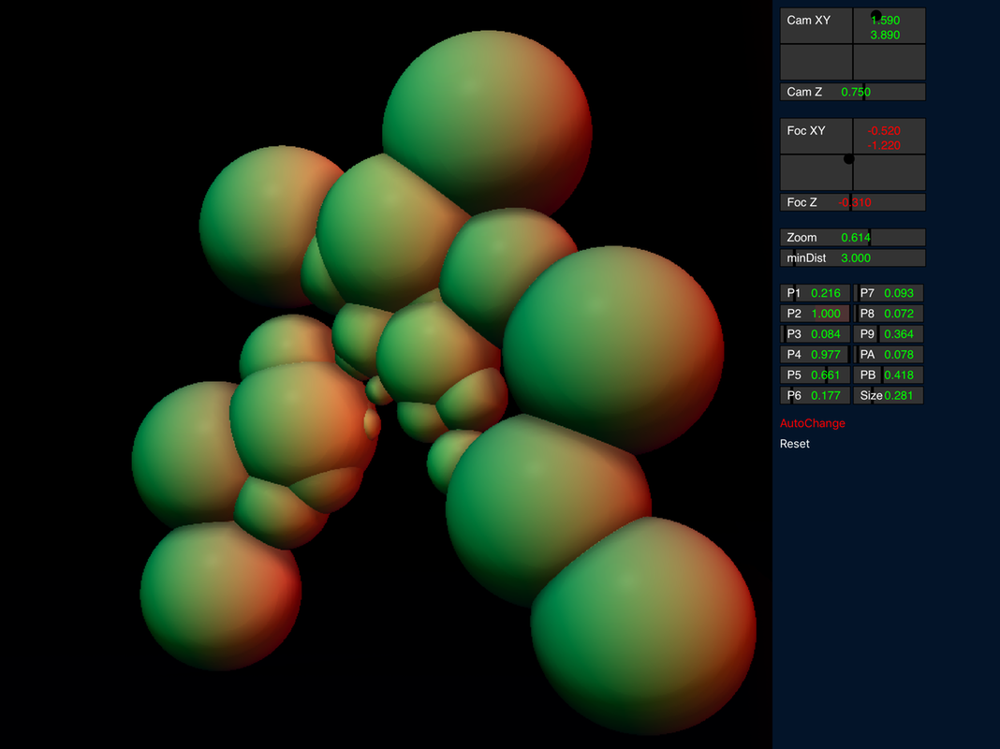

# DistanceField
Distance Fields demo for IOS iPad uses Swift and Metal

Utility program for iPad for experiments in raymarching lighting effects.

Learned some ray marching lighting effects by studying shockham's mandelbulb posting: \
https://github.com/shockham/mandelbulb \
This app uses his shader routines, and adds a bunch of widgets so we can alter the parameters in real-time.

Learned Distance Field equations from : http://iquilezles.org/www/articles/distfunctions/distfunctions.htm \
This app animates many spheres using the Distance Field algorithms.

Slide finger on widgets to change respective parameter. \
P1...PB affect fields in the lighting routines,  'Size' is the sphere sine control. \
Press 'AutoChange' to enable automatic param changes.

$$$$$$$$$$$$$$$$$$$$$$$$$$$$$ \
To everyone reading this, I need your help. \
If I increase the nmber of spheres past 32 (in shader.h), I get the run-time error:  \
"Compute function exceeds available temporary registers". \

I have many things to get past this, but no success. \
Money is no problem. \
Please make the necessary changes to the shader to allow for many more spheres, \
then name your price to teach me what you did.

thanks \
$$$$$$$$$$$$$$$$$$$$$$$$$$$$$ 

